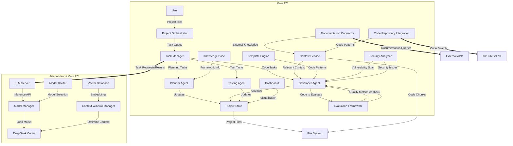

# AutoCoder: Autonomous LLM Development Framework

A sophisticated framework for autonomous code generation and project development using LLM models on a Jetson Nano, with orchestration from a main PC.

## System Architecture



## Core Components in Detail

### 1. Orchestration Layer (Main PC)

#### Project Orchestrator
- **Purpose**: Central coordinator for the entire system
- **Functions**:
  - Initializes project structure based on user prompt
  - Maintains overall project state
  - Coordinates between agents
  - Manages build processes
- **Implementation**: `src/orchestration/project_orchestrator.py`

#### Task Manager
- **Purpose**: Manages the execution flow of all tasks
- **Functions**:
  - Task prioritization
  - Dependency resolution
  - Resource allocation
  - Failure handling and retry logic
- **Implementation**: `src/orchestration/task_manager.py`

### 2. Agent Layer (Main PC)

#### Planner Agent
- **Purpose**: Decompose high-level project goals into actionable tasks
- **Functions**:
  - Project structure planning
  - Dependency graph creation
  - Implementation roadmap generation
  - Technology stack selection
- **Patterns**: Strategy Pattern for different planning approaches
- **Implementation**: `src/agents/planner.py`

#### Developer Agent
- **Purpose**: Generate and refine code
- **Functions**:
  - Code generation via LLM prompting
  - Code review and improvement
  - Documentation generation
  - Integration of components
- **Patterns**: Factory Pattern for different code generation strategies
- **Implementation**: `src/agents/developer.py`

#### Testing Agent
- **Purpose**: Validate code functionality
- **Functions**:
  - Test case generation
  - Test execution
  - Coverage analysis
  - Bug identification and reporting
- **Patterns**: Observer Pattern for test result notifications
- **Implementation**: `src/agents/tester.py`

### 3. Context Management (Main PC)

#### Context Service
- **Purpose**: Manage and serve relevant context for code generation
- **Functions**:
  - Code chunking by semantic units
  - Relevance scoring
  - Context window optimization
  - Dependency tracking
  - **RAG-based context retrieval**
- **Algorithms**:
  - Recursive descent parsing for code chunking
  - TF-IDF for relevance scoring
  - LRU caching for frequently used contexts
  - **Vector embeddings for semantic search**
  - **Hybrid retrieval combining keyword and semantic search**
- **Implementation**: `src/context/context_service.py`

#### Template Engine
- **Purpose**: Provide code patterns and templates
- **Functions**:
  - Framework-specific templates
  - Design pattern implementations
  - Boilerplate code generation
  - Style enforcement
- **Implementation**: `src/templates/template_engine.py`

### 4. LLM Inference Layer

#### LLM Server
- **Purpose**: Expose LLM capabilities via API
- **Functions**:
  - HTTP API for inference requests
  - Batching of similar requests
  - Caching of common responses
  - Health monitoring
  - **Model performance metrics API**
  - **Generation control endpoints**
  - **Debugging and tracing endpoints**
- **Implementation**: `src/llm/server.py`
- **Deployment Options**: 
  - **Jetson Nano**: For edge deployment scenarios
  - **Main PC**: For development and higher performance needs
  - **Hybrid Mode**: Distributing inference based on model size and task

#### Model Manager
- **Purpose**: Handle model loading and optimization
- **Functions**:
  - Model quantization
  - VRAM optimization
  - Model switching based on task
  - Performance monitoring
- **Implementation**: `src/llm/model_manager.py`

#### Context Window Manager
- **Purpose**: Optimize prompt construction for limited context windows
- **Functions**:
  - Context prioritization
  - Token counting
  - Window sliding algorithms
  - Information density optimization
- **Implementation**: `src/llm/context_window_manager.py`

### 5. User Interface Layer (Main PC)
#### Dashboard
- **Purpose**: Provide visual oversight and control of projects
- **Functions**:
  - Project progress visualization
  - Code quality metrics display
  - Resource usage monitoring
  - Direct interaction with agents
- **Implementation**: `src/ui/dashboard.py`

#### Code Visualization
- **Purpose**: Visualize code structure and relationships
- **Functions**:
  - Dependency graphs
  - Class/function relationship diagrams
  - Code evolution timeline
  - Hotspot identification
- **Implementation**: `src/ui/code_visualizer.py`

### 6. External Knowledge Integration
#### Documentation Connector
- **Purpose**: Access external documentation and resources
- **Functions**:
  - API documentation retrieval
  - Framework usage examples
  - Best practice recommendations
  - Common error solutions
- **Implementation**: `src/knowledge/doc_connector.py`

#### Code Repository Integration
- **Purpose**: Learn from existing codebases
- **Functions**:
  - GitHub code search
  - Pattern recognition from open-source projects
  - Style matching to existing repositories
  - Reference implementation discovery
- **Implementation**: `src/knowledge/repo_connector.py`

## Context Handling Strategy

### Chunking Mechanisms
1. **Semantic Chunking**
   - Divides code by logical units (functions, classes)
   - Preserves scope and namespace information
   - Tracks cross-references between chunks

2. **Dependency-Based Chunking**
   - Identifies import/require statements
   - Maps dependency graphs
   - Prioritizes context based on call hierarchy

3. **Information Density Analysis**
   - Measures "importance" of code segments
   - Compresses repetitive patterns
   - Prioritizes novel or complex segments

### Context Selection Algorithm
```python
def select_context(current_task, available_chunks, max_tokens=2048):
    # 1. Start with directly related chunks
    context = get_directly_related_chunks(current_task)
    
    # 2. Add dependency chunks until near token limit
    dependencies = get_dependencies(context)
    context += prioritize_dependencies(dependencies, 
                                      token_budget=max_tokens * 0.3)
    
    # 3. Add interface definitions
    interfaces = get_interfaces(context)
    context += summarize_interfaces(interfaces, 
                                   token_budget=max_tokens * 0.2)
    
    # 4. Add example usage if space permits
    if token_count(context) < max_tokens * 0.8:
        examples = get_usage_examples(current_task)
        context += select_examples(examples, 
                                  token_budget=max_tokens * 0.2)
    
    return optimize_context(context, max_tokens)
```

## Design Patterns & Framework Integration

### Implemented Design Patterns
1. **Observer Pattern**: For event notification between agents
2. **Strategy Pattern**: For swappable algorithm implementations
3. **Factory Pattern**: For creating various code generators
4. **Command Pattern**: For task execution and undo capabilities
5. **Adapter Pattern**: For interfacing with different LLMs

### Framework Support
The system includes templates and knowledge for common frameworks:

#### Python Frameworks
- **FastAPI**: Web API development
- **Flask**: Lightweight web applications
- **Django**: Full-featured web applications
- **PyTorch/TensorFlow**: ML/AI applications

#### JavaScript Frameworks
- **React**: UI development
- **Express**: Backend services
- **Next.js**: Full-stack applications

#### DevOps & Infrastructure
- **Docker**: Containerization templates
- **GitHub Actions**: CI/CD workflows
- **Kubernetes**: Deployment configurations

## Communication Protocol

### Enhanced API Routes
- **Core Routes**:
  - `/generate`: Main code generation endpoint
  - `/refactor`: Code refactoring endpoint
  - `/explain`: Code explanation endpoint
  - `/test`: Test generation endpoint
  
- **Management Routes**:
  - `/projects`: Project CRUD operations
  - `/tasks`: Task management operations
  - `/agents`: Agent configuration and control
  
- **Monitoring Routes**:
  - `/metrics`: System performance metrics
  - `/health`: Service health checks
  - `/logs`: Log access and management

- **Development Routes**:
  - `/debug`: Debug information and tracing
  - `/feedback`: Submit feedback on generations
  - `/models`: Model management and switching

### PC to Jetson Communication
- **Transport**: WebSocket for bi-directional communication
- **Format**: JSON with the following structure:
  ```json
  {
    "request_id": "unique-id",
    "request_type": "code_generation|completion|refactoring",
    "prompt": "The actual prompt text",
    "parameters": {
      "temperature": 0.7,
      "max_tokens": 1024,
      "top_p": 0.9
    },
    "context_chunks": [
      {"id": "chunk1", "content": "def example():..."},
      {"id": "chunk2", "content": "class User:..."}
    ]
  }
  ```

### Response Format
  ```json
  {
    "request_id": "unique-id",
    "status": "success|error",
    "generated_code": "def new_function():...",
    "metadata": {
      "inference_time_ms": 1250,
      "token_count": 156,
      "confidence_score": 0.87
    }
  }
  ```

## Setup Instructions

### Jetson Nano Setup
```bash
# 1. Clone repository
git clone https://github.com/fr4iser90/LLM-NanoJetson-Framework2
cd LLM-NanoJetson-Framework2

# 2. Install dependencies
pip install -r requirements.txt

# 3. Download and quantize model
# For DeepSeek Coder 1.3B (fastest, least VRAM)
python setup_model.py --model deepseek-coder-1.3b --quantize 4bit
# OR for DeepSeek Coder 6.7B (better quality, more VRAM)
python setup_model.py --model deepseek-coder-6.7b --quantize 4bit

# 4. Start LLM server
python llm_server.py --model models/deepseek-coder-1.3b-q4.gguf --port 8080
```

### Main PC Setup
```bash
# 1. Clone the AutoCoder repository
git clone https://github.com/fr4iser90/LLM-NanoJetson-Framework2
cd LLM-NanoJetson-Framework2

# 2. Enter development environment
nix-shell

# 3. Configure connection to Jetson Nano
python setup.py --nano-ip 192.168.1.100 --nano-port 8080

# 4. Start the AutoCoder service
python autocoder.py --serve

# 5. In another terminal, start a new project
python client.py --prompt "Create a FastAPI backend for a todo application with SQLite database"
```

## Project Generation Process

1. **Project Initialization**
   - User provides initial project description
   - System analyzes requirements and generates a project plan
   - Directory structure and initial files are created
   - Dependencies are identified

2. **Architectural Planning**
   - System designs overall architecture
   - Component relationships are defined
   - API contracts are established
   - Data models are designed

3. **Incremental Development**
   - Components are implemented in dependency order
   - Each component goes through generation, testing, and refinement
   - Integration tests ensure components work together
   - Documentation is generated alongside code

4. **Monitoring & Feedback**
   - Developer agent monitors progress and roadblocks
   - Continuous evaluation of generated code quality
   - Self-correction based on test results
   - User can provide feedback at checkpoints

5. **Completion & Delivery**
   - Final integration and system tests
   - Comprehensive documentation generation
   - Performance optimization
   - Deployment scripts generation

## Advanced Features

### Self-Healing Code
The system can detect and fix issues in previously generated code:
- Test failure analysis
- Exception handling improvement
- Performance bottleneck detection
- Memory leak identification

### Continuous Learning
The framework implements memory mechanisms:
- Successful patterns are stored for reuse
- Failed approaches are documented to avoid repetition
- User preferences are tracked
- Project-specific conventions are learned

### Multi-Model Support
The system can leverage different models for different tasks:
- Fast, small models for simple completions
- Larger models for complex architectural decisions
- Specialized models for particular languages/frameworks
- Ensemble approaches for critical components

### RAG-Enhanced Context Management
The system leverages modern RAG techniques to improve code generation:
- **Vector Database Integration**: Stores code embeddings for semantic search
- **Chunking Optimization**: Intelligent chunking for retrieval efficiency
- **Hybrid Search**: Combines keyword and semantic search for optimal context retrieval
- **Multi-Index Approach**: Separate indices for documentation, code, and examples
- **Relevance Feedback**: Learns from which retrieved contexts were most useful

### Multi-Agent Collaboration
The system employs specialized agents that work together:
- **Language Specialists**: Experts in specific programming languages
- **Architecture Specialists**: Focus on system design patterns
- **UI/UX Specialists**: Generate and evaluate user interfaces
- **Database Specialists**: Optimize data models and queries
- **DevOps Specialists**: Generate deployment and CI/CD configurations

### Evaluation Framework
A comprehensive system to evaluate generated code:
- **Static Analysis**: Code quality, style, and potential bugs
- **Performance Benchmarking**: Execution time and resource usage
- **Security Scanning**: Vulnerability detection
- **Maintainability Metrics**: Complexity and documentation quality
- **Test Coverage Analysis**: Completeness of test suite

### Version Control Integration
Seamless integration with Git workflows:
- **Automatic commits** with meaningful messages
- **Branch management** for features and experiments
- **Pull request generation** with detailed descriptions
- **Conflict resolution** assistance
- **CI/CD integration** for automated testing

### Explainable AI Layer
The system explains its code generation decisions:
- **Design rationale documentation**
- **Alternative approaches consideration**
- **Trade-off analysis** for architectural decisions
- **Pattern application reasoning**
- **Educational comments** that explain complex code

## Getting Started with Development

The codebase follows these conventions:
- Type hints throughout Python code
- Comprehensive unit tests
- Detailed docstrings
- Component-based architecture

To contribute:
1. Fork the repository
2. Create a feature branch
3. Add tests for your feature
4. Implement your feature
5. Run the test suite
6. Submit a pull request

## License
MIT License

## Jetson Nano Optimierung

### Hardware-Beschleunigung
- **TensorRT Integration**: Optimierung der LLM-Inferenz mit NVIDIA TensorRT
- **CUDA-Optimierung**: Angepasste CUDA-Kernel für Matrixoperationen
- **Quantisierungsstrategien**:
  - INT8-Quantisierung für höchste Geschwindigkeit
  - Mixed-Precision (FP16/INT8) für ausgewogene Leistung
  - Dynamische Quantisierung für kritische Modellschichten

### Ressourcenmanagement
- **Speicheroptimierung**:
  - Modell-Sharding: Verteilung großer Modelle
  - Gradient-Checkpointing: Reduzierung des VRAM-Bedarfs
  - Selektives Layer-Loading: Nur benötigte Schichten laden
- **Energiesparende Modi**:
  - Automatisches Heruntertakten bei Inaktivität
  - Energieprofilbasierte Modellauswahl
  - Batch-Verarbeitung von Inferenzanfragen

### Kompakte Modelle
- **Unterstützung für spezialisierte Edge-Modelle**:
  - TinyLlama (1.1B Parameter)
  - Phi-2 (2.7B Parameter)
  - StableLM-Nano (1.3B Parameter)
  - DeepSeek-Coder-Lite (1.3B Parameter)
- **Distillierte Modelle**: Wissenstransfer von großen zu kleinen Modellen

## Verteiltes Computing

### Hybrid-Architektur
- **Aufgabenverteilung**:
  - Jetson Nano: Codegenerierung, Refactoring, Datenverarbeitung
  - Hauptrechner: Komplexe Planung, Architekturentscheidungen, Tests
- **Nahtlose Synchronisation** zwischen Geräten mit effizientem Datenaustausch
- **Fault-Tolerance**: Automatisches Failover bei Verbindungsverlust

### Offline-Modus
- **Offline-Codegenerierung** mit kompakten Modellen
- **Inkrementelle Synchronisation** bei Wiederverbindung
- **Lokaler Cache** für häufig verwendete Codeschnipsel und Muster

## Leistungsoptimierung für Jetson Nano

### Modell-Pipeline-Optimierung
- **Kontext-Kompression**: Reduzierung der Token-Anzahl durch semantische Kompression
- **Progressive Generation**: Schrittweise Code-Generierung mit Feedback-Schleifen
- **Prompt-Optimierung**: Automatische Anpassung von Prompts für minimalen Token-Verbrauch

### Spezielle Konfigurationen
- **Jetson Nano 4GB**:
  ```bash
  python setup_model.py --model deepseek-coder-1.3b --quantize 4bit --optimize nano4gb
  ```
- **Jetson Nano 2GB**:
  ```bash
  python setup_model.py --model phi-1.5 --quantize 3bit --optimize nano2gb --low-memory
  ```

### Benchmarking-Tools
- **Performance-Analyse**: Werkzeuge zur Identifizierung von Engpässen
  ```bash
  python benchmark.py --device jetson-nano --model all --task code_generation
  ```
- **Automatische Konfigurationsempfehlungen** basierend auf Hardwareleistung

## Erweiterte Jetson Nano Einrichtung

### Optimale Systemkonfiguration
```bash
# System-Optimierung für maximale LLM-Leistung
sudo nvpmodel -m 0  # Max Performance-Modus
sudo jetson_clocks  # Maximale CPU/GPU-Taktrate
sudo sysctl -w vm.swappiness=10  # Swap-Nutzung minimieren
```

### JetPack-Optimierungen
- JetPack 4.6+ mit CUDA 11.4 empfohlen
- Installation optimierter Python-Pakete:
```bash
sudo apt install -y python3-pip libopenblas-dev
pip3 install --upgrade numpy torch==2.0.0 torchvision==0.15.1 --extra-index-url https://download.pytorch.org/whl/nv-jetson-cuda-11.4
```

### Docker-Container für isolierte Umgebung
```bash
# Pull optimierter Container mit vorinstalliertem Framework
docker pull autocoder/jetson:latest

# Container mit GPU-Zugriff starten
docker run --runtime nvidia -it --rm --network host \
  -v ~/projects:/workspace/projects \
  autocoder/jetson:latest
```

# LLM-NanoJetson-Framework2

Ein verteiltes System für KI-gestützte Code-Generierung mit einem Jetson Nano als LLM-Server.

## Architektur

Das System besteht aus drei Hauptkomponenten:

1. **LLM-Server** (läuft auf Jetson Nano)
   - Hostet das KI-Modell (deepseek-coder-1.3b)
   - Nutzt die Jetson GPU für Inferenz
   - Port: 8888

2. **Orchestrator** (läuft auf dem Haupt-PC)
   - Koordiniert den gesamten Entwicklungsprozess
   - Kommuniziert mit dem LLM-Server
   - Verwaltet Tasks und Projektfortschritt
   - Port: 9999

3. **Frontend** (läuft auf dem Haupt-PC)
   - React-basierte Benutzeroberfläche
   - Kommuniziert mit dem Orchestrator
   - Port: 3333

## Deployment

### Auf dem Jetson Nano:
```bash
# Nur den LLM-Server starten
docker-compose up llm-server
```

### Auf dem Haupt-PC:
```bash
# Orchestrator und Frontend starten
docker-compose up orchestrator frontend
```

## Konfiguration

Die `docker-compose.yml` definiert die Verbindungen:

```yaml
services:
  llm-server:      # Läuft auf Jetson Nano
    ports: 8888:8080
    runtime: nvidia # Nutzt Jetson GPU

  orchestrator:     # Läuft auf Haupt-PC
    environment:
      - LLM_SERVER_URL=http://192.168.178.36:8888  # IP des Jetson

  frontend:        # Läuft auf Haupt-PC
    environment:
      - REACT_APP_API_URL=http://localhost:9999     # Orchestrator
```